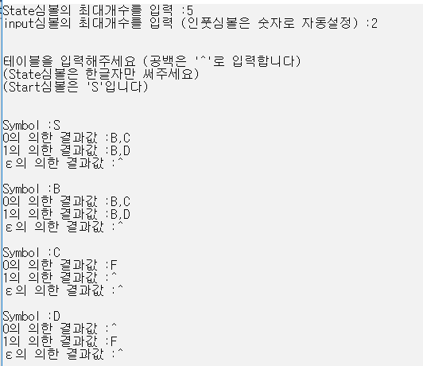
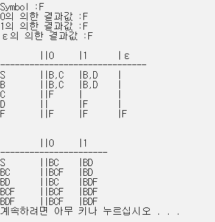
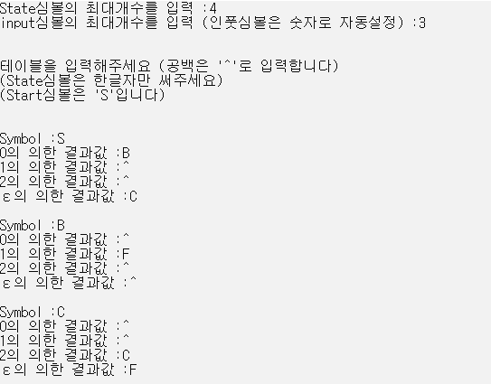
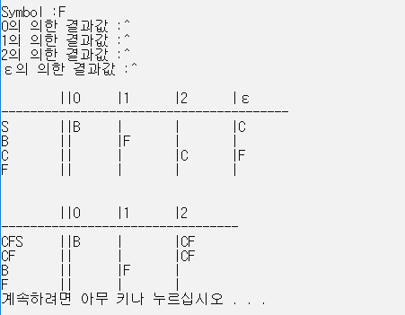

# NFAConverter
 
 컴파일러 강의를 듣고 만든 토이 프로젝트입니다  
 
 Non-definition Finite Automata (NFA)
 에서 
 Definition Finite Automata(DFA)로 바꿔주는 프로그램입니다

 한 입력에 여러상태가 되버리는 NFA를
 여러상태로 변환시 여러상태를 한상태로 묶어서 DFA로 만들었습니다

 ε-Closure (빈입력에도 다른 상태로 변함)
 관련해서도 구현했습니다

- 실행화면  
 
 
 
   
